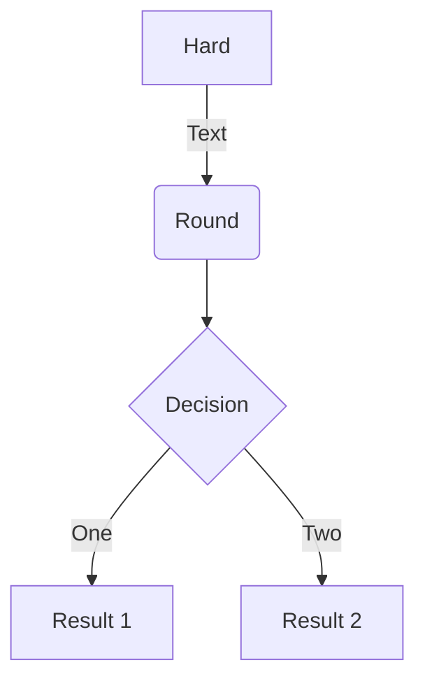
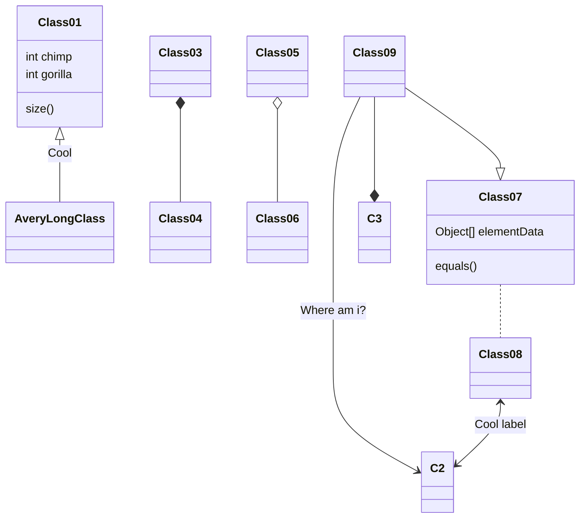
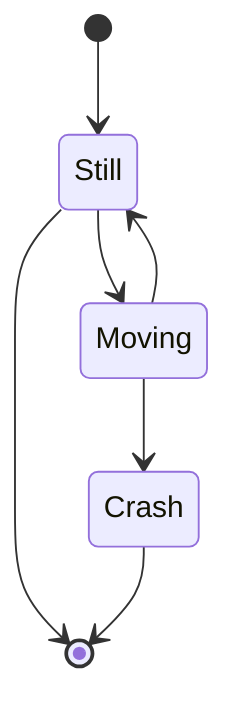

Hugo Blox разработан, чтобы предоставить создателям технического контента бесперебойный опыт. Вы можете сосредоточиться на контенте, а Hugo Blox позаботится обо всем остальном.

Используйте популярные инструменты, такие как Plotly, Mermaid и фреймы данных.

## Визуализация

Hugo Blox поддерживает популярный [Plotly](https://plot.ly/) Формат для интерактивной визуализации данных. С Plotly вы можете разработать практически любую визуализацию, которую только можете себе представить!

Сохраните Plotly JSON в папке вашей страницы, например `line-chart.json`, а затем добавьте шорткод `` в том месте, где вы хотите, чтобы отображалась диаграмма.

Демо:



Вы также можете найти [Plotly JSON Editor](http://plotly-json-editor.getforge.io/) полезным.

## Диаграммы

Hugo Blox поддерживает расширение _Mermaid_ Markdown для диаграмм.

Как пример **flowchart**:

    ```mermaid
    graph TD
    A[Hard] -->|Text| B(Round)
    B --> C{Decision}
    C -->|One| D[Result 1]
    C -->|Two| E[Result 2]
    ```

отображает как



Как пример **sequence diagram**:

    ```mermaid
    sequenceDiagram
    Элис->>Джон: Привет, Джон, как дела?
    loop Healthcheck
        Джон->>Джон: Борьба с ипохондрией
    end
    Примечание справа от Джона: Рациональные мысли!
    Джон-->>Элис: Хорошо!
    Джон->>Боб: Ты как?
    Боб-->>Джон: Очень хорошо!
    ```

отображает как

```mermaid
sequenceDiagram
Элис->>Джон: Привет, Джон, как дела?
loop Healthcheck
    Джон->>Джон: Борьба с ипохондрией
end
Примечание справа от Джона: Рациональные мысли!
Джон-->>Элис: Хорошо!
Джон->>Боб: Ты как?
Боб-->>Джон: Очень хорошо!
```

Как пример **class diagram**:

    ```mermaid
    classDiagram
    Class01 <|-- AveryLongClass : Cool
    Class03 *-- Class04
    Class05 o-- Class06
    Class07 .. Class08
    Class09 --> C2 : Where am i?
    Class09 --* C3
    Class09 --|> Class07
    Class07 : equals()
    Class07 : Object[] elementData
    Class01 : size()
    Class01 : int chimp
    Class01 : int gorilla
    Class08 <--> C2: Cool label
    ```

отображает как



Как пример **state diagram**:

    ```mermaid
    stateDiagram
    [*] --> Still
    Still --> [*]
    Still --> Moving
    Moving --> Still
    Moving --> Crash
    Crash --> [*]
    ```

отображает как



## Дата-фреймы

Save your spreadsheet as a CSV file in your page's folder and then render it by adding the _Table_ shortcode to your page:

```go

```

отображает как



## Была ли эта страница вам полезна? Рассмотрите возможность поделиться ею 🙌
